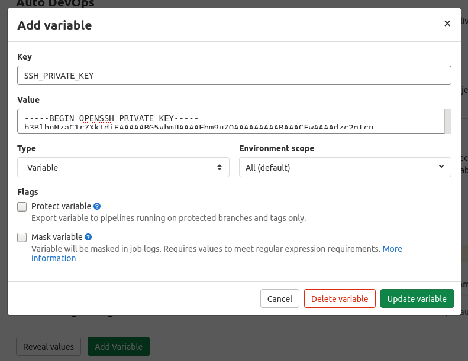
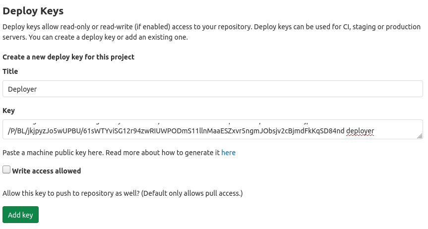
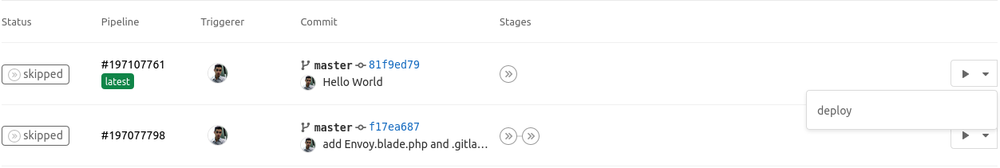

## Introdução
Neste tutorial iremos utilizar o sistema de CI/CD do GitLab para automatizarmos os testes e disponibilizarmos as novas versões do software de forma contínua e descomplicada.

Iremos utilizar o framework PHP Laravel. Iremos configurar tarefas de com o Envoy, e depois veremos como testar o software e implantá-lo com GitLab CI / CD via Entrega Contínua.

> PS.: Este tutorial leva em conta que você já tenha instalado o framework laravel, tenha instalado alguma distribuição do linux, bem como o NGINX, e  o PHP.

## Testes de unidade
Todas as novas instalações do Laravel vem com dois tipos de testes, teste de recursos (feature test) e testes de unidade (unit test), colocados no diretório de testes.

**Exemplo de teste de unidade**

```php
<?php

namespace Tests\Unit;

use Tests\TestCase;
use Illuminate\Foundation\Testing\RefreshDatabase;

class ExampleTest extends TestCase
{
    /**
     * A basic test example.
     *
     * @return void
     */
    public function testBasicTest()
    {
        $this->assertTrue(true);
    }
}
```

Por padrão o Laravel usa o framework **PHPUnit** para executar os testes.

Rode os testes usando o comando **vendor/bin/phpunit**

```bash
OK (1 test, 1 assertions)
```

## Publicando o projeto no GitLab
Com o projeto instalado e funcionando localmente, vamos enviar o código para o repositório remoto.

> Para saber como criar um novo projeto no GitLab acesse: *https://docs.gitlab.com/ee/gitlab-basics/create-project.html*. Depois de criar o projeto, siga as instruções da linha de comando exibidas na página inicial do projeto.

**Vamos iniciar um repositório do git para guardar o código do projeto**
```
mkdir blog
cd blog
git init
git remote add origin git@gitlab.example.com:<NOME_USUARIO>/<NOME_REPOSITORIO>.git
git add .
git commit -m 'Initial Commit'
git push -u origin master
```

## Configurando o servidor

### Criando um usuário de deploy

**Abra algum terminal no seu linux e digite os seguintes comando*
```
sudo adduser deployer
sudo setfacl -R -m u:deployer:rwx /var/www
```
*Nos comandos acima nós, criamos um usuário chamado deployer e demos a ele permissão de escrite-leitura e execução nas pastas /var/www*

> Caso você não tenha o pacote ACL instalado no seu servidor, instale-o usando o seguinte comando:
```
sudo apt install acl
```

### Alternando entre usuários no linux
Antes de gerarmos a chave ssh vamos alternar para o usuário que criamos anteriormente.
```bash
su deployer
```

### Gerando um chave ssh
Para que possamos implantar nosso aplicativo no servidor de produção a partir de um repositório privado no GitLab. Primeiro, precisamos gerar um novo par de chaves SSH sem senha para o usuário **deployer**.

**Para gerar uma chave ssh use o seguinte comando**
```bash
ssh-keygen -t rsa -b 2048 -C "email@example.com"
```

**Acesse: https://docs.gitlab.com/ee/ssh/README.html para conhecer outras formas de gerar chaves ssh**

### Adicionando a chave ssh
Após a criação da chave precisamos adiciona-la a lista de chaves confiaveis. Ainda logado na conta do usuário **deployer**. Execute os seguintes comandos.


```
cat ~/.ssh/id_rsa.pub >> ~/.ssh/authorized_keys
cat ~/.ssh/id_rsa
```

*Nos comando acima nós, copiamos o conteúdo da chave pública para uma lista de chaves confiaveis. Em seguida escrevemos o conteúdo da chave privada para o STDOUT do linux. Copie o conteúdo desta chave, iremos usa-la em seguida.*

### Adicionando a chave ssh privada no GitLab
Agora, vamos adicionar o conteúdo da chave SSH privada ao seu projeto GitLab como uma variável. Variáveis ​​são ​​definidas pelo usuário e são armazenadas em .gitlab-ci.yml, para fins de segurança.

**Navegue até: Settings > CI/CD > Variables**

No campo KEY, adicione o nome SSH_PRIVATE_KEY e, no campo VALUE, cole a chave privada que você copiou anteriormente.


Agora vamos adicionar a chave pública ao projeto como uma chave de implantação, o que nos dará a capacidade de acessar nosso repositório do servidor por meio do protocolo SSH.

Ainda logado com o usuário deployer, execute o seguinte comando:
```
cat ~/.ssh/id_rsa.pub
```

**Navegue até: Settings > Repository > Deploy Keys**

No campo Título, adicione o nome que desejar e cole a chave pública no campo Chave.


Agora, vamos clonar nosso repositório no servidor apenas para garantir que o usuário **deployer** possui acesso ao repositório.

Ainda logado com o usuário deployer, execute o seguinte comando:
```
git clone git@gitlab.example.com:<NOME_USUARIO>/<NOME_REPOSITORIO>.git
```

### Configurando o servidor NGINX
Abra o arquivo de configuração do servidor NGINX padrão digitando:

```bash
sudo vim /etc/nginx/sites-available/default
```

A configuração deve ficar assim.
```bash
server {
    root /var/www/app/current/public;
    server_name example.com;

    ...
}
```

### Instalando o Envoy para execução das tarefas do deploy
Para usar o Envoy, primeiro devemos instalá-lo em nossa máquina local.

Para instalar o envio, use o comando
```bash
composer global require laravel/envoy
```

### Criando nosso primeiro Envoy script
Crie um arquivo chamado Envoy.blade.php na raiz do projeto.

Vamos adicionar uma tarefa simples afim de entender como o Envoy funciona.

```php
@servers(['web' => 'remote_username@remote_host'])

@task('list', ['on' => 'web'])
    ls -l
@endtask
```

Dentro da diretiva **@task**, definimos os comandos bash que devem ser executados no servidor quando a tarefa for executada.

**Na máquina local, use o comando run para executar tarefas do Envoy.**
```bash
envoy run list
```

Essa tarefa irá se conectar ao servidor e listar o conteúdo do diretório.

> PS.: O Envoy não é uma dependência do Laravel, portanto pode ser usado em qualquer aplicação PHP.

## Deploy Automatizado
A implantação irá clonar a versão mais recente do repositório no GitLab, instalar as dependências do Composer e ativar a nova versão baixada, criando os links simbolicos necessárioas para funcionamento do projeto.

### Adicionando mais poder as nossas tarefas com Envoy

### A diretiva @setup
O primeiro passo é definirmos as variaveis dentro da diretiva de @setup.

```bash
...

@setup
    $repository = 'git@gitlab.example.com:<NOME_USUARIO>/<NOME_REPOSITORIO>.git';
    $releases_dir = '/var/www/app/releases';
    $app_dir = '/var/www/app';
    $release = date('YmdHis');
    $new_release_dir = $releases_dir .'/'. $release;
    $keep_releases = 7;
@endsetup
...

```
* $repository é o endereço do nosso repositório no GitLab
* O diretório $releases_dir é onde iremos implantar a aplicação
* $app_dir é a localização real do aplicativo dentro do servidor
* A pasta $release irá manter as diferentes versões de build da aplicação. Então toda vez que rodarmos o deploy uma nova versão do nosso aplicativo será com a data atual
* $new_release_dir é o caminho completo da nova versão que está em uso no momento
* $keep_releases é o número de releases que iremos manter como diretório no servidor

### A diretiva @story
A diretiva @story nos permite definir uma lista de tarefas serão executadas como uma única tarefa.

Teremos três tarefas. clone_repository, run_composer, update_symlinks.

```bash

...

@story('deploy')
    clone_repository
    run_composer
    update_symlinks
@endstory

...

```

Vamos criar essas tarefas.

### Clonando o repositório
A primeira tarefa criará o diretório de releases (se não existir) e, em seguida, clonará a branch master do repositório no diretório de release:

```bash

...

@task('clone_repository')
    echo 'Cloning repository'
    [ -d {{ $releases_dir }} ] || mkdir {{ $releases_dir }}
    git clone --depth 1 {{ $repository }} {{ $new_release_dir }}
    cd {{ $new_release_dir }}
    git reset --hard {{ $commit }}
@endtask

...

```

### Instalando as dependências com o Composer
```bash
...

@task('run_composer')
    echo "Starting deployment ({{ $release }})"
    cd {{ $new_release_dir }}
    composer install --prefer-dist --no-scripts -q -o
@endtask

...

```

### Ativando os novos releases
O link simbólico atual irá sempre apontar para a versão mais recente da nossa aplicação:

```bash
...

@task('update_symlinks')
    echo "Linking storage directory"
    rm -rf {{ $new_release_dir }}/storage
    ln -nfs {{ $app_dir }}/storage {{ $new_release_dir }}/storage

    echo 'Linking .env file'
    ln -nfs {{ $app_dir }}/.env {{ $new_release_dir }}/.env

    echo 'Linking current release'
    ln -nfs {{ $new_release_dir }} {{ $app_dir }}/current
@endtask

...
```

### O script do Envoy completo

```php
@servers(['web' => 'deployer@127.0.0.1'])

@setup
    $repository = 'git@gitlab.example.com:<NOME_USUARIO>/<NOME_REPOSITORIO>.git';
    $releases_dir = '/var/www/app/releases';
    $app_dir = '/var/www/app';
    $release = date('YmdHis');
    $new_release_dir = $releases_dir .'/'. $release;
    $keep_releases = 7;
@endsetup

@story('deploy')
    clone_repository
    run_composer
    update_symlinks
    change_owner
    restart_services
    clean
@endstory

@task('clone_repository')
    echo 'Cloning repository'
    [ -d {{ $releases_dir }} ] || mkdir {{ $releases_dir }}
    git clone --depth 1 {{ $repository }} {{ $new_release_dir }}
    echo "Repository has been cloned";
@endtask

@task('run_composer')
    echo "Starting deployment ({{ $release }})"
    cd {{ $new_release_dir }}
    composer install --prefer-dist --no-scripts -q -o
@endtask

@task('update_symlinks')
    echo "Linking storage directory"
    rm -rf {{ $new_release_dir }}/storage
    ln -nfs {{ $app_dir }}/storage {{ $new_release_dir }}/storage

    echo 'Linking .env file'
    ln -nfs {{ $app_dir }}/.env {{ $new_release_dir }}/.env

    echo 'Linking current release'
    ln -nfs {{ $new_release_dir }} {{ $app_dir }}/current
@endtask

@task('change_owner')
    echo "Changing owner"
    chown -R deployer:www-data {{ $new_release_dir }}
    chown -R deployer:www-data {{ $app_dir }}/current
    chown -R www-data:www-data {{ $app_dir }}/storage
@endtask

@task('restart_services')
    echo "Restarting services"
    service nginx restart
    service php7.4-fpm reload
@endtask

{{-- Clean old releases --}}
@task('clean')
    echo "Clean old releases";
    cd {{ $releases_dir }};
    rm -rf $(ls -t | tail -n +{{ $keep_releases }});
@endtask
```

> PS.: No primeiro deploy será necessário copiar manualmente a pasta **storage** do laravel e o arquivo **.env** para o diretório raiz da aplicação **/var/www/app**.

### Publique o Script do Envoy no GitLab

```bash
git add Envoy.blade.php
git commit -m 'Add Envoy'
git push origin master
```

## Integração contínua com GitLab
Vamos preparar o ambiente do gitlab Para fazermos o build, os testes e a implantação da aplicação laravel com o **GitLab CI/CD**. Usaremos uma imagem do docker para facilitar a execução das tarefas.

### Criando um container docker
**Crie um Dockerfile na raiz do seu diretório**

```Dockerfile
FROM php:7.4
RUN apt-get update
RUN apt-get install -qq git curl libmcrypt-dev libjpeg-dev libpng-dev libfreetype6-dev libbz2-dev
RUN apt-get clean
RUN docker-php-ext-install mcrypt pdo_mysql zip
RUN curl --silent --show-error https://getcomposer.org/installer | php -- --install-dir=/usr/local/bin --filename=composer
RUN composer global require "laravel/envoy=~1.0"
```

### Configurando o GitLab Container Registry
Com Dockerfile finalizado, precisamos compilá-lo e enviá-lo para o **GitLab Container Registry**.

O **GitLab Container Registry** é o local onde podemos armazenar imagens para uso posterior.

Navegue até a página **Packages & Registries > Container Registry**

Primeiro faça login no **GitLab Container Registry** usando nosso nome de usuário e senha GitLab
```bash
docker login registry.gitlab.com
```

Para criar o container utilize o seguinte comando
```bash
docker build -t registry.gitlab.com/<NOME_USUARIO>/NOME_PROJETO .
```

Para enviar o container para o **GitLab Container Registry** utilize o seguinte comando
```bash
docker push registry.gitlab.com/<NOME_USUARIO>/NOME_PROJETO
```

### Publique o Dockerfile no gitlab
```bash
git add Dockerfile
git commit -m 'Add Dockerfile'
git push origin master
```

### Configurando o GitLab CI/CD
Vamos criar um arquivo chamado **.gitlab-ci.yml** na raiz do nosso projeto.

```yml
# Caminho recebido após publicar o container no GitLab Container Registry
image: registry.gitlab.com/<USERNAME>/NOME_PROJETO:latest

stages:
  - test
  - deploy

unit_test:
  stage: test
  script:
    - cp .env.example .env
    - composer install
    - php artisan key:generate
    - php artisan migrate
    - vendor/bin/phpunit

deploy_production:
  stage: deploy
  script:
    - 'which ssh-agent || ( apt-get update -y && apt-get install openssh-client -y )'
    - eval $(ssh-agent -s)
    - ssh-add <(echo "$SSH_PRIVATE_KEY")
    - mkdir -p ~/.ssh
    - '[[ -f /.dockerenv ]] && echo -e "Host *\n\tStrictHostKeyChecking no\n\n" > ~/.ssh/config'

    - ~/.composer/vendor/bin/envoy run deploy --commit="$CI_COMMIT_SHA"
  environment:
    name: production
    url: http://127.0.0.1
  when: manual
  only:
    - master
```

### Para ativar o GitLab CI/CD publique o .gitlab-ci.yml no gitlab
```bash
git add .gitlab-ci.yml
git commit -m 'Add .gitlab-ci.yml'
git push origin master
```

### Fazendo um deploy automatizado
Após realizar um commit no seu repositório, navegue até **CI/CD > Pipelines** e clique em **deploy**



Referência: https://docs.gitlab.com/ee/ci/examples/laravel_with_gitlab_and_envoy


